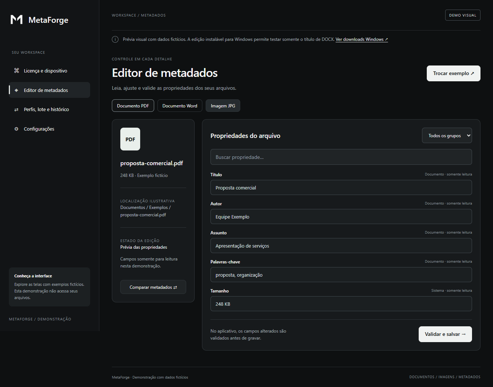
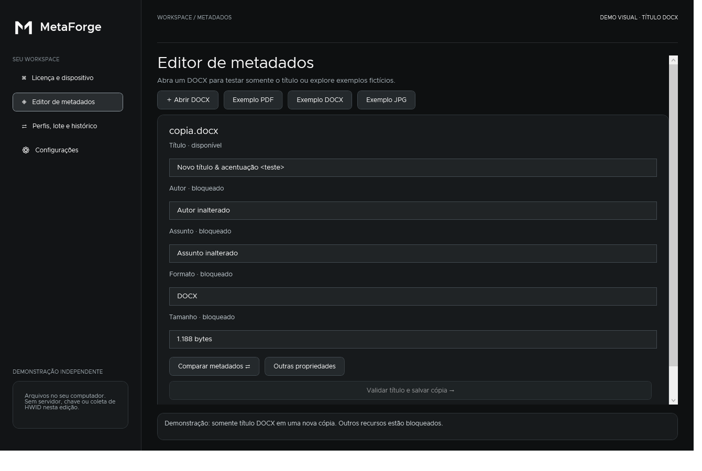

# MetaForge — demonstração pública

**Conheça a interface do MetaForge e teste a alteração do título de um documento Word, preservando o arquivo original.**

O MetaForge é um aplicativo desktop para editar, organizar e conferir metadados de documentos e imagens. Metadados são informações associadas ao arquivo, como título, autor, assunto e datas, que ajudam a identificar e organizar seu conteúdo.

Este repositório contém **somente a vitrine web e a documentação da demonstração**. A edição instalável é distribuída em Releases. **O painel administrativo, o servidor, o código-fonte C#, o motor completo de edição, bancos de dados, chaves e serviços de licenciamento não estão incluídos.**

## Acessos

| O que você deseja | Onde acessar |
| --- | --- |
| Conhecer as telas no navegador | [Abrir a vitrine](https://gsantanaoffsec.github.io/metaforge-test-version/) |
| Baixar a edição Windows | [Baixar MetaForge Demo](https://github.com/gsantanaoffsec/metaforge-test-version/releases/download/demo-v1.0.0/MetaForge-Demo-win-x64.zip) |
| Consultar downloads e notas | [Release da demonstração](https://github.com/gsantanaoffsec/metaforge-test-version/releases/tag/demo-v1.0.0) |
| Conferir os arquivos baixados | [SHA256SUMS.txt](https://github.com/gsantanaoffsec/metaforge-test-version/releases/download/demo-v1.0.0/SHA256SUMS.txt) |

## Objetivos do MetaForge

O aplicativo completo foi pensado para tornar as propriedades dos arquivos mais fáceis de consultar, revisar e organizar:

1. **Dar visibilidade aos metadados:** consultar propriedades de documentos e imagens em uma interface acessível.
2. **Permitir ajustes com revisão:** apresentar os campos editáveis, validar valores e conferir o resultado da gravação.
3. **Facilitar a organização:** reutilizar regras, preparar conjuntos de arquivos e acompanhar operações no histórico.
4. **Ajudar na conferência:** comparar arquivos e verificar requisitos escolhidos pelo usuário.
5. **Trabalhar localmente:** o conteúdo dos documentos não é enviado ao servidor de licenciamento.

Esta edição apresenta a proposta visual e libera um teste pequeno e concreto. Ela não oferece as funções completas do produto.

## Duas formas de conhecer

**Vitrine web:** explore as seções, três exemplos de arquivo e prévias das ferramentas pelo navegador, inclusive no celular. Os dados são fictícios. A vitrine não abre, edita ou exporta arquivos; não instala componentes nem se conecta ao servidor do produto.

**MetaForge Demo para Windows x64:** uma edição independente e instalável, com runtime incluído. Você pode abrir um DOCX, alterar **somente o título** e salvar uma **nova cópia**. Todos os demais campos e operações estão bloqueados. PDF e imagens aparecem somente como exemplos fictícios. Esta edição não contém o motor completo do MetaForge, servidor, ExifTool, ativação de licença ou coleta de HWID.

O instalador cria uma cópia em `%LOCALAPPDATA%\MetaForgeDemo` e um atalho no menu Iniciar, sem exigir administrador. Pode ser desinstalado pela própria tela de Configurações. Não é registrado em Aplicativos instalados do Windows.





## Recursos disponíveis e bloqueados

| Recurso | Vitrine web | Windows Demo |
| --- | --- | --- |
| Navegar pelas quatro seções principais | Disponível | Disponível |
| Exemplos de PDF, Word e imagem | Dados fictícios | Dados fictícios |
| Prévias de perfis, lote, inspeção e histórico | Disponível | Disponível |
| Abrir um DOCX do computador | Indisponível | Disponível |
| Ler título, autor e assunto de um DOCX | Indisponível | Disponível |
| Editar somente o título e salvar nova cópia | Indisponível | Disponível |
| Sobrescrever o original ou outro arquivo existente | Indisponível | Bloqueado |
| Editar autor, assunto, datas, GPS ou demais metadados | Indisponível | Bloqueado |
| Editar PDF, JPG, JPEG, PNG ou TXT | Indisponível | Bloqueado |
| Executar perfis, lote, políticas, inventário ou normalização | Indisponível | Bloqueado |
| Comparação real, renomeação, filas e exportação de relatórios | Indisponível | Bloqueado |
| Ativação de licença, servidor ou coleta de HWID | Não incluído | Não incluído |
| Painel administrativo | Não incluído | Não incluído |

Nas prévias, estados como “preparado” ou “cópia criada” são ilustrações: não representam operações executadas no seu computador.

## Conhecer a interface no navegador

1. Abra a [vitrine do MetaForge](https://gsantanaoffsec.github.io/metaforge-test-version/).
2. Escolha **Licença e dispositivo**, **Editor de metadados**, **Perfis, lote e histórico** ou **Configurações**.
3. No editor, alterne entre **Documento PDF**, **Documento Word** e **Imagem JPG**.
4. Use a busca e o filtro de grupos para explorar as propriedades apresentadas.
5. No workspace, abra as prévias das ferramentas e as quatro abas.

A vitrine funciona em telas pequenas e seus campos são somente leitura. Ela não possui seletor de arquivos nem APIs de processamento do MetaForge.

## Instalar e executar no Windows

### Requisitos

- Windows x64 com interface gráfica e permissão para executar aplicativos.
- Permissão para gravar arquivos no perfil de usuário e na pasta de saída dos documentos.
- Espaço para download, extração e instalação: reserve pelo menos **400 MB**, além das cópias de documentos. O executável com runtime ocupa aproximadamente 140 MB.

**Não é necessário instalar .NET separadamente, criar conta, obter uma chave ou configurar um servidor.** O aplicativo Windows não executa diretamente em macOS ou Linux; nesses sistemas, use a vitrine web.

### Instalação

1. Baixe **MetaForge-Demo-win-x64.zip** na [release oficial](https://github.com/gsantanaoffsec/metaforge-test-version/releases/tag/demo-v1.0.0).
2. Extraia **todos os arquivos** para uma pasta. Não execute o programa de dentro do ZIP.
3. Abra **MetaForgeDemo.exe**.
4. Leia as condições. Se concordar, marque **Li e aceito as condições desta demonstração**.
5. Clique em **Instalar e abrir**.

O instalador cria `%LOCALAPPDATA%\MetaForgeDemo` e o atalho **MetaForge Demo** no menu Iniciar. A pasta é independente da edição completa. Nas próximas aberturas, utilize esse atalho.

O executável **não possui certificado Authenticode comercial**. O Windows pode informar que o publicador é desconhecido. Os hashes permitem conferir o arquivo, mas não substituem uma assinatura do publicador. Políticas do dispositivo podem impedir a execução; respeite essas restrições e consulte seu administrador quando necessário.

### Testar a alteração de título

1. Na seção **Editor de metadados**, clique em **Abrir DOCX**.
2. Selecione um documento Word de teste.
3. Confira as propriedades. Somente **Título** estará editável.
4. Altere o título e clique em **Validar título e salvar cópia**.
5. Escolha um **nome novo**, com extensão `.docx`, em uma pasta onde você possa gravar.
6. Abra a cópia novamente na demo ou consulte as propriedades dela no Word para conferir.

**O título alterado é a propriedade de metadados do arquivo. Não é o texto do título no corpo do documento, o cabeçalho da página ou o nome do arquivo.**

O original permanece preservado. A demo recusa substituir qualquer destino existente. Ao trocar de arquivo ou fechar com uma alteração pendente, haverá uma confirmação de descarte.

### Limites da edição Windows

- Windows x64; não é um aplicativo para macOS ou Linux.
- DOCX com até 32 MB; título de até 512 caracteres.
- Exige propriedades básicas existentes em `docProps/core.xml`.
- Recusa documentos com assinatura digital, entradas duplicadas e estruturas incompatíveis.
- Preserva o original e recusa sobrescrever destinos existentes.
- Não substitui o aplicativo completo e não usa sua avaliação gratuita comercial.

## Problemas comuns

| Situação | Como proceder |
| --- | --- |
| Botão de salvar desativado | Abra um DOCX real e altere o título. Exemplos fictícios e títulos sem mudança não são gravados. |
| “O destino já existe” | Escolha outro nome; a demonstração não sobrescreve arquivos. |
| “O arquivo original mudou” | Abra o DOCX novamente antes de repetir a alteração. |
| DOCX sem propriedades básicas | Use outro documento salvo pelo Word. A demo não cria toda a estrutura de metadados ausente. |
| DOCX com assinatura digital | Use um documento de teste sem assinatura. A demo recusa invalidar uma assinatura existente. |
| Falha ao instalar ou substituir a cópia instalada | Feche uma instância anterior e tente novamente. Confira as permissões da pasta. |
| Falha de permissão ao salvar | Escolha uma pasta em que você possa criar arquivos. |
| Outro recurso informa bloqueio | É o comportamento esperado: apenas o título DOCX está liberado nesta edição. |

## Desinstalar

Abra **Configurações → Desinstalar esta demonstração**. O aplicativo fecha e solicita a remoção de seus próprios arquivos e do atalho. Os documentos que você abriu e as cópias que salvou não são excluídos.

Se a política do computador impedir esse processo, feche a demo e remova manualmente `%LOCALAPPDATA%\MetaForgeDemo` e o atalho **MetaForge Demo** no menu Iniciar. Preserve qualquer arquivo pessoal que você tenha colocado nessa pasta.

## Privacidade e conteúdo do pacote

A demo Windows lê o DOCX selecionado e grava uma cópia mediante uma ação explícita. Não possui telemetria própria, ativação, coleta de HWID, envio de documentos ou painel administrativo. Os exemplos web são fixos e fictícios; o link de download direciona ao GitHub.

O ZIP Windows contém **somente** `MetaForgeDemo.exe`, `LEIA-ME.txt`, `TERMOS-DE-USO.md`, `OFL.txt`, `DOTNET-LICENSE.txt`, `DOTNET-NOTICES.txt`, `WPF-LICENSE.txt` e `SHA256SUMS.txt`. Os textos de licença preservam os avisos dos componentes incluídos. Não há fontes C#, PDB, banco de dados, chave privada ou configuração de produção.

O arquivo de checksums anexado separadamente à release permite conferir os ZIPs. No PowerShell:

```powershell
Get-FileHash .\MetaForge-Demo-win-x64.zip -Algorithm SHA256
```

Compare o resultado com a linha correspondente de `SHA256SUMS.txt`.

## Publicar a vitrine

Envie `docs/`, `.gitignore`, este README, `LEIA-ME-DEMO.txt` e `TERMOS-DE-USO.md` para **este repositório separado**. Em **Settings → Pages**, escolha **Deploy from a branch**, a branch publicada e a pasta **/docs**, depois salve. [Instruções oficiais do GitHub Pages](https://docs.github.com/en/pages/getting-started-with-github-pages/configuring-a-publishing-source-for-your-github-pages-site).

O endereço da vitrine é `https://gsantanaoffsec.github.io/metaforge-test-version/`. O HTML/CSS/JavaScript é público e inspecionável pelo navegador; contém somente interface e dados fictícios. A publicação usa a branch `main` e `/docs`.

Para prévia local, abra `docs/index.html` ou sirva a pasta `docs` com um servidor estático local.

## Publicar o instalador

Em **Releases → Draft a new release**, crie uma tag, por exemplo `demo-v1.0.0`, e anexe **MetaForge-Demo-win-x64.zip** e seu arquivo de checksums. Publique a release e divulgue o link dela. [Instruções oficiais de releases](https://docs.github.com/en/repositories/releasing-projects-on-github/managing-releases-in-a-repository).

O executável inclui o runtime e pode exceder 100 MB. Distribua o ZIP em **Releases**, sem adicionar binários ao histórico Git. Não envie `private-source/`, `artifacts/`, fontes C#, arquivos de teste, `.git` ou o repositório principal para esta publicação. Essas pastas locais estão ignoradas.

Fontes da demonstração e scripts de compilação são mantidos localmente, fora do conteúdo público. Faça um backup privado deles antes de trocar de computador: `git pull` deste repositório não os recupera.

## Verificações locais

Foram concluídas 40 verificações da edição Windows e 90 verificações da vitrine. Os testes cobrem alteração exclusiva do título, preservação de outras partes do DOCX e da origem, recusa de sobrescrita, entradas incompatíveis, navegação rápida, foco, filtros, abas por teclado e layouts de 375 a 1920 pixels. O instalador publicado abriu com o runtime incluído, sem executar a instalação.

A instalação/desinstalação completa em uma máquina Windows limpa não foi executada nesta entrega. Não há certificado comercial de assinatura. Os testes locais não substituem a validação em outros ambientes nem garantem funcionamento em todos os computadores.

## Direitos e proteção

Veja [TERMOS-DE-USO.md](TERMOS-DE-USO.md). As restrições de uso ressalvam permissões legais e licenças de terceiros. Texto, assinatura digital ou hash não tornam o software impossível de analisar. A proteção adotada nesta demo é distribuir uma edição reduzida que não inclui o motor completo do produto. O executável gerado não está assinado com certificado Authenticode comercial.
